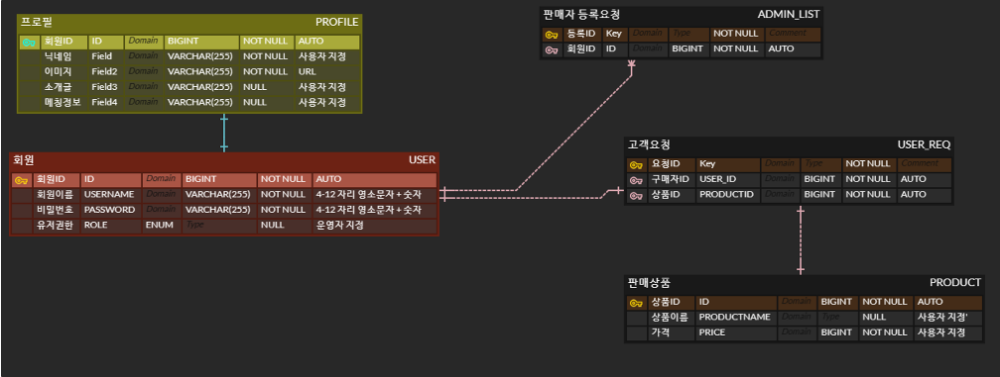

# 1.Spring Team Matching System
# Team 🐣
>  1. 팀장 : 박서우 - `채팅, 프로필관리 담당 `
> 2. 팀원 : 이영빈 - `검색, 포인트, Security, 일반회원,관리자 담당 `
> 3. 팀원 : 박상훈 - `검색, 구매자 , 일반회원 담당`
> 4. 팀원 : 김민수 - `채팅, 전반적 프로젝트 설계 담당`
> 5. 팀원 : 김민재 - `회원 가입, 포인트 담당`

# 프로젝트 요구사항 및 진행상황  💼
 - ##  기본기능
 >- [x] 유저별 요구사항( 조회, 작성, 권한요청 ) 
 >- [x] 판매자 요구사항( 조회, 등록, 삭제,수정 )
 >- [x] 운영자 요구사항( 조회, 권한등록, 삭제 )

 - ## 심화기능
>- [x] 검색기능( 키워드 검색,판매자 검색 )
>- [x] 포인트 기능( 포인트 조회, 상품 포인트 가격, 포인트 결재, 포인트 수신, 포인트 추가 )
>- [x] 고객 - 판매자 대화 기능( 대화방 생성, 대화 메세지 전송기능, 대화방 메세제 목록 조회, 대화방 종료 )

# 개발환경  🛠
 
> Spring Version : 3.0.1 
> JDK Version : 17.0.5

# ERD 📊  

# UML ✍️

> #### Team Notion : https://www.notion.so/SA-e25d2886267d40ca95a298b7e1aa74ac
> #### Team GitHub : https://github.com/zeroempty2/morningWorkOut

